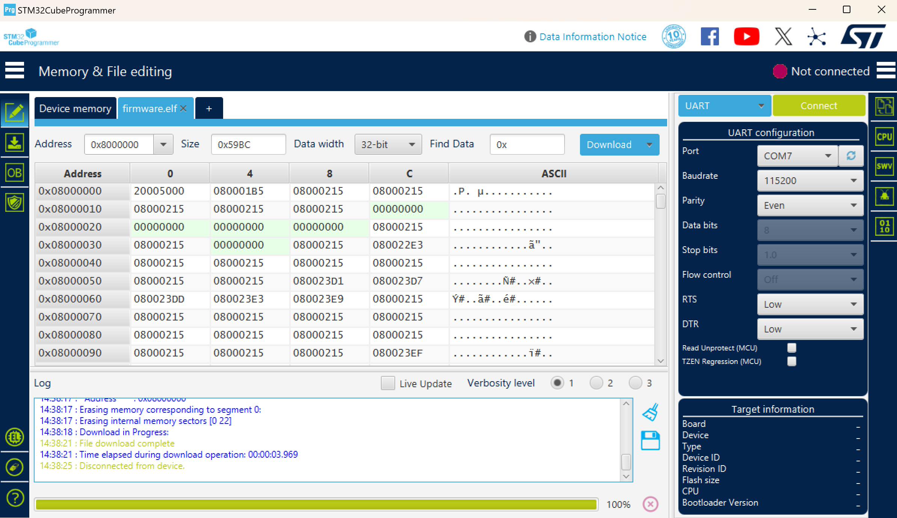

# UAC Control

## Introduction

This repository is a module for the [LoRa Wireless Control Drone](https://github.com/Lorraine0666/LoRa-Wireless-Control-Drone), designed to control the attitude and communication of the drone via LoRa technology.

## Structure

The code is built using `Platform IO`. All related header files are located in the `include` folder, and the source code files can be found in the `src` folder.

## Prerequisites

Before compiling and running the code, make sure you have the following installed:

- **VS Code**: The integrated development environment (IDE).
- **Platform IO Extension**: This is the plugin used for building and uploading the code to your STM32 device.
- **STM32CubeProgrammer**: A utility to flash your STM32 microcontroller.

- **Hc-T串口助手**: This works to send information to UAV.

## Compile & Run

1. **Install the required software**:
   - Download and install **VS Code** from [here](https://code.visualstudio.com/).
   - Install the **Platform IO** extension from the VS Code marketplace.
   - Download and install **STM32CubeProgrammer** from [STMicroelectronics](https://www.st.com/en/development-tools/stm32cubeprog.html).
   - Download and install **HC-T串口助手** from [official website](https://www.hc01.com/downloads).

2. **Set up the environment**:
   - Open VS Code and make sure the **Platform IO** extension is installed.
   - Clone or download this repository to your local machine.

3. **Build the code**:
   - Open the `UAV_control` folder in VS Code.
   - Click the **tick icon** (checkmark) on the top right of the VS Code window to build the project.

4. **Connect the STM32 board**:
   - Connect your STM32 development board to your computer via USB or another supported connection.

5. **Flash the firmware**:
   - Download the corresponding `.elf` file (compiled output).
   - Use **STM32CubeProgrammer** to flash the firmware onto your STM32 board, or use the Platform IO extension directly to upload the code to the board.

6. **Set `HC-14`**
   - Open `HC-T串口助手` and set the following parameters for both HC-14 modules:
     - Set the **波特率** (baud rate) to **115200**.
     - Ensure both **HC-14** modules are set to the **same 无线通信频道** (wireless communication channel).
     - Set the **无线通信速率** (wireless communication rate) to **3**.
   - It is essential that both HC-14 modules are configured with identical settings, as the modules will remember the user's settings for future connections.

7. **Send control message**
   - Type the message you wish to send.
   - Click **发送信息** to transmit the message. Make sure both HC-14 modules are set up identically to ensure reliable communication.

## Troubleshooting

- If you encounter issues with uploading the code, ensure that the STM32 board is properly connected and the correct port is selected in Platform IO.
- If the build fails, check the `platformio.ini` file for the correct board configuration and dependencies.